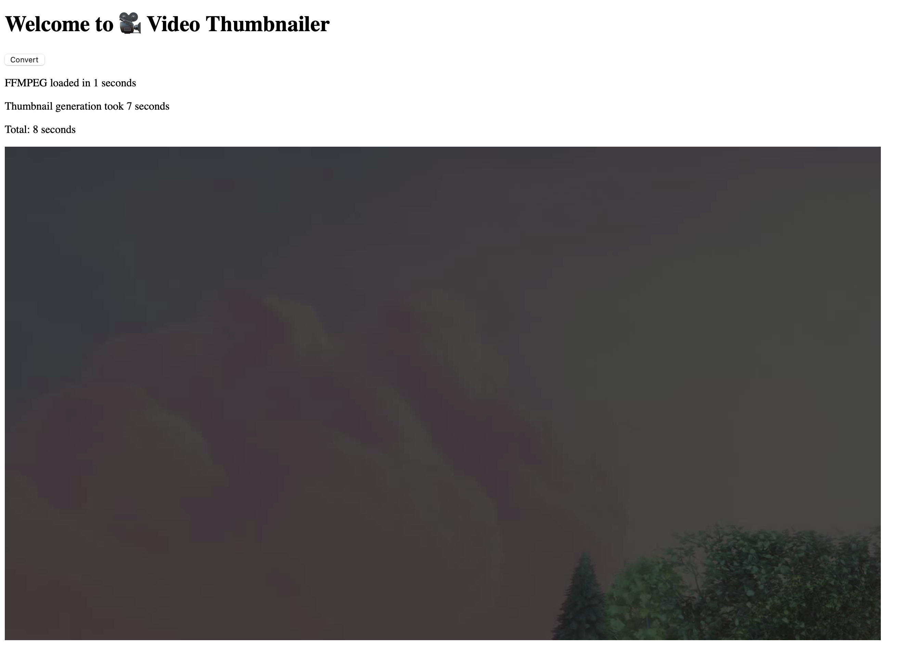

# Video Thumbnailer

[](./LICENSE)
[](https://www.npmjs.com/package/video-thumbnailer)
[](https://npmcharts.com/compare/video-thumbnailer?minimal=true)
[](https://npmcharts.com/compare/video-thumbnailer?minimal=true)
[](https://github.com/eugenehp/video-thumbnailer/watchers)
[](https://github.com/eugenehp/video-thumbnailer/stargazers)
[](https://github.com/eugenehp/video-thumbnailer/network/members)
[](https://github.com/eugenehp/video-thumbnailer/issues?utf8=%E2%9C%93&q=is%3Aissue+is%3Aopen+label%3Abug)
[](https://github.com/eugenehp/video-thumbnailer/issues)
[](https://github.com/eugenehp/video-thumbnailer/pulls)

Get thumbnails from video files (mp4) in a browser using [ffmpeg](https://ffmpeg.org) via [wasm](https://webassembly.org)

```shell
npm install video-thumbnailer
```

## Getting started

You can find full example in [example/src/routes/+page.svelte](example/src/routes/+page.svelte) built with [SvelteKit](https://kit.svelte.dev)

```typescript
import { VideoThumbnailer } from "video-thumbnailer";

await thumbnailer.load();
// or you can select a File from the browser
const urlOrFile =
  "https://storage.googleapis.com/gtv-videos-bucket/sample/BigBuckBunny.mp4";

// contains a Blob that can be directly set to img.src
const image = await thumbnailer.getThumbnail(urlOrFile);
```

## Demo

To run the demo:

```shell
cd example
npm run dev
# navigate to http://localhost:5173
```



## Development

To build the library:

```shell
cd video-thumbnailer
npm run build
```

## License

[MIT](./LICENSE)

Copyright © 2023 [Eugene Hauptmann](http://twitter.com/eugenehp)
